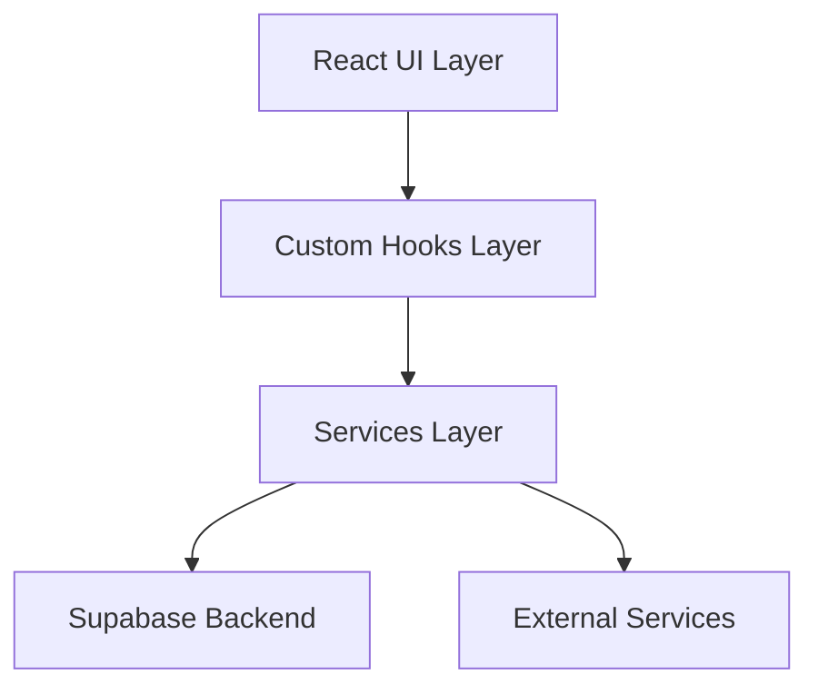
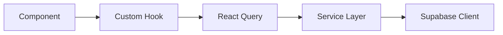
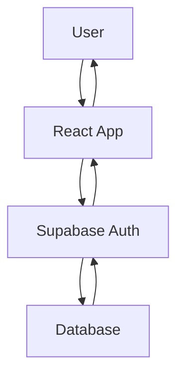
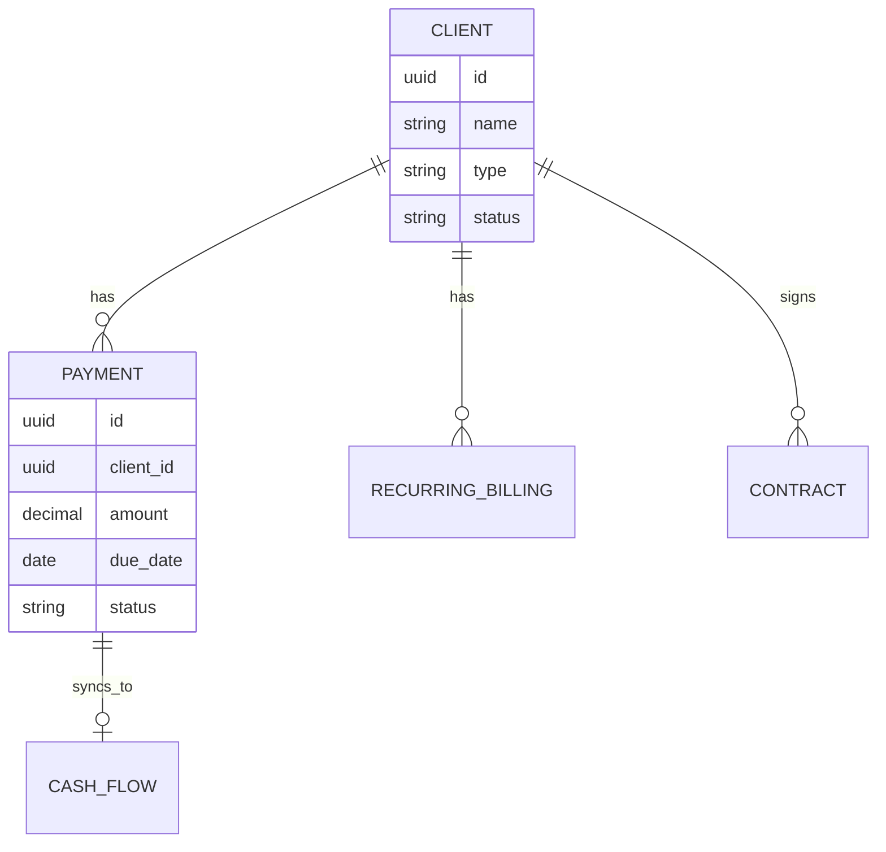

# 🏗️ FlowCode Financial - System Architecture

## 📋 Table of Contents
1. [System Overview](#system-overview)
2. [Architecture Principles](#architecture-principles)
3. [Component Architecture](#component-architecture)
4. [Data Flow Architecture](#data-flow-architecture)
5. [State Management](#state-management)
6. [Security Architecture](#security-architecture)
7. [Integration Patterns](#integration-patterns)

## 🎯 System Overview

FlowCode Financial is a modern React-based financial management system built with a modular, scalable architecture. The system follows Domain-Driven Design principles with clear separation of concerns.

### High-Level Architecture



## 🎨 Architecture Principles

### 1. **Modular Design**
- Features are organized by domain (billing, payments, contracts)
- Each module is self-contained with its own components, hooks, and types
- Shared utilities and components are centralized

### 2. **Type Safety First**
- Comprehensive TypeScript usage throughout
- Strict type definitions for all data structures
- Interface-driven development

### 3. **Single Responsibility**
- Each component has a clear, single purpose
- Services handle business logic
- Hooks manage data fetching and state

### 4. **Composition over Inheritance**
- Components are built through composition
- Reusable UI components via shadcn/ui
- Custom hooks for shared functionality

## 🧩 Component Architecture

### Layer Structure

```
┌─────────────────────────┐
│     Pages Layer         │ ← Route-level components
├─────────────────────────┤
│   Feature Components    │ ← Domain-specific logic
├─────────────────────────┤
│    Shared Components    │ ← Reusable UI components
├─────────────────────────┤
│    UI Primitives        │ ← shadcn/ui base components
└─────────────────────────┘
```

### Component Categories

#### 1. **Page Components** (`src/pages/`)
- Route-level components
- Data fetching orchestration
- Layout composition
- User journey management

```typescript
// Example: Overview.tsx
export const Overview = () => {
  const { metrics, isLoading } = useMetrics();
  // Page-level data fetching and layout
};
```

#### 2. **Feature Components** (`src/components/{domain}/`)
- Domain-specific business logic
- Complex user interactions
- Feature-complete modules

```typescript
// Example: RecurringBilling.tsx
export const RecurringBilling = () => {
  // Complex billing logic
  // Multiple data sources
  // Advanced filtering and search
};
```

#### 3. **Shared Components** (`src/components/`)
- Cross-feature reusable components
- Common UI patterns
- Business logic abstractions

#### 4. **UI Primitives** (`src/components/ui/`)
- Base UI components from shadcn/ui
- Consistent design system
- Accessibility built-in

### Component Communication Patterns

#### 1. **Props Down, Events Up**
```typescript
// Parent passes data down
<PaymentTable 
  payments={payments}
  onUpdate={handleUpdate}
/>

// Child emits events up
const handleSave = () => {
  onUpdate(newPayment);
};
```

#### 2. **Context for Global State**
```typescript
// AuthContext for authentication
const { user, signIn, signOut } = useAuth();

// ThemeProvider for theme state
const { theme, setTheme } = useTheme();
```

## 🔄 Data Flow Architecture

### Data Fetching Strategy



### 1. **Custom Hooks Pattern**
Each domain has specialized hooks that encapsulate:
- Data fetching logic
- Error handling
- Loading states
- Data transformations

```typescript
// Example: useBillingData hook
export const useBillingData = () => {
  const { data: billings, isLoading } = useQuery({
    queryKey: ['billings'],
    queryFn: fetchBillings,
  });

  const transformedData = useMemo(() => {
    // Transform raw data for UI consumption
    return processBillingData(billings);
  }, [billings]);

  return { billings: transformedData, isLoading };
};
```

### 2. **Service Layer Pattern**
Services handle:
- API communication
- Business logic
- Data validation
- Error handling

```typescript
// Example: paymentService.ts
export const paymentService = {
  async updatePayment(id: string, data: PaymentData) {
    // Validation
    // API call
    // Error handling
    // Return typed response
  },
  
  async syncToCashFlow(paymentId: string) {
    // Business logic for cash flow sync
  }
};
```

## 🗄️ State Management

### State Categories

#### 1. **Server State** (React Query)
- API data caching
- Background synchronization
- Optimistic updates
- Error recovery

```typescript
const { data, mutate } = useMutation({
  mutationFn: updatePayment,
  onSuccess: () => {
    queryClient.invalidateQueries(['payments']);
  },
});
```

#### 2. **Client State** (React useState/useReducer)
- UI state (modals, forms)
- User interactions
- Local preferences

```typescript
const [searchTerm, setSearchTerm] = useState('');
const [selectedTab, setSelectedTab] = useState('all');
```

#### 3. **Global State** (React Context)
- Authentication state
- Theme preferences
- App-wide settings

```typescript
const AuthContext = createContext({
  user: null,
  signIn: () => {},
  signOut: () => {},
});
```

### State Flow Patterns

#### 1. **Optimistic Updates**
```typescript
const { mutate } = useMutation({
  mutationFn: updatePayment,
  onMutate: async (newPayment) => {
    // Cancel outgoing queries
    await queryClient.cancelQueries(['payments']);
    
    // Snapshot previous value
    const previousPayments = queryClient.getQueryData(['payments']);
    
    // Optimistically update
    queryClient.setQueryData(['payments'], old => 
      old.map(p => p.id === newPayment.id ? newPayment : p)
    );
    
    return { previousPayments };
  },
});
```

#### 2. **Error Recovery**
```typescript
const { mutate } = useMutation({
  mutationFn: updatePayment,
  onError: (err, newPayment, context) => {
    // Rollback optimistic update
    queryClient.setQueryData(['payments'], context.previousPayments);
    
    // Show error to user
    toast({
      title: "Erro",
      description: "Falha ao atualizar pagamento.",
      variant: "destructive"
    });
  },
});
```

## 🔒 Security Architecture

### Authentication Flow



### Security Layers

#### 1. **Frontend Security**
- Route protection with ProtectedRoute component
- Role-based access control
- Client-side validation
- Secure token storage

```typescript
<ProtectedRoute requireAuth>
  <Dashboard />
</ProtectedRoute>
```

#### 2. **Database Security (RLS)**
- Row Level Security policies
- User-based data isolation
- Role-based permissions
- Audit trails

```sql
-- Example RLS Policy
CREATE POLICY "Users can only see their own data"
ON payments FOR SELECT
USING (auth.uid() = user_id);
```

#### 3. **API Security**
- JWT token validation
- Rate limiting
- Input sanitization
- CORS configuration

### Data Validation Strategy

#### 1. **Frontend Validation**
```typescript
// Form validation with zod
const paymentSchema = z.object({
  amount: z.number().min(0.01),
  description: z.string().min(1),
  due_date: z.string().datetime(),
});
```

#### 2. **Backend Validation**
```typescript
// Edge Function validation
const validatePayment = (data: any): PaymentData => {
  // Runtime validation
  // Type coercion
  // Error handling
};
```

## 🔌 Integration Patterns

### External Service Integration

#### 1. **Email Service (Resend)**
```typescript
// Service wrapper pattern
export const emailService = {
  async sendBillingNotification(params: EmailParams) {
    try {
      const response = await supabase.functions.invoke('send-billing-email', {
        body: params
      });
      return response;
    } catch (error) {
      // Error handling
      throw new EmailServiceError(error);
    }
  }
};
```

#### 2. **AI Chat (OpenRouter)**
```typescript
// Service abstraction
export const aiService = {
  async chat(message: string) {
    // API call abstraction
    // Response processing
    // Error handling
  }
};
```

### Webhook Integration Pattern

```typescript
// Webhook handler structure
export const webhookHandlers = {
  'contract.signed': (payload) => {
    // Handle contract signing
  },
  'contract.created': (payload) => {
    // Handle contract creation
  }
};
```

## 📊 Data Architecture

### Database Design Patterns

#### 1. **Entity Relationships**


#### 2. **Data Transformation Pipeline**
```typescript
// Raw DB Data -> Domain Objects -> UI Models
const transformBillingData = (rawData: DBBilling[]): UIBilling[] => {
  return rawData.map(billing => ({
    ...billing,
    formattedAmount: formatCurrency(billing.amount),
    dueDate: format(billing.due_date, 'dd/MM/yyyy'),
    statusLabel: getStatusLabel(billing.status)
  }));
};
```

### Caching Strategy

#### 1. **React Query Configuration**
```typescript
const queryClient = new QueryClient({
  defaultOptions: {
    queries: {
      staleTime: 5 * 60 * 1000, // 5 minutes
      cacheTime: 10 * 60 * 1000, // 10 minutes
      refetchOnWindowFocus: false,
    },
  },
});
```

#### 2. **Cache Invalidation Patterns**
```typescript
// Optimistic updates with cache invalidation
const updatePaymentMutation = useMutation({
  mutationFn: updatePayment,
  onSuccess: () => {
    // Invalidate related queries
    queryClient.invalidateQueries(['payments']);
    queryClient.invalidateQueries(['cash-flow']);
    queryClient.invalidateQueries(['metrics']);
  },
});
```

## 🚀 Performance Considerations

### 1. **Component Optimization**
- Memoization with useMemo and useCallback
- React.memo for expensive components
- Lazy loading for route-level components

### 2. **Data Fetching Optimization**
- Background refetching
- Parallel queries where possible
- Selective field fetching

### 3. **Bundle Optimization**
- Code splitting by routes
- Dynamic imports for large dependencies
- Tree shaking for unused code

This architecture enables FlowCode Financial to be maintainable, scalable, and robust while providing an excellent developer experience.