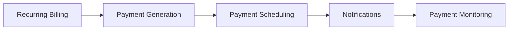
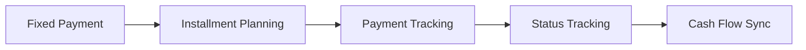
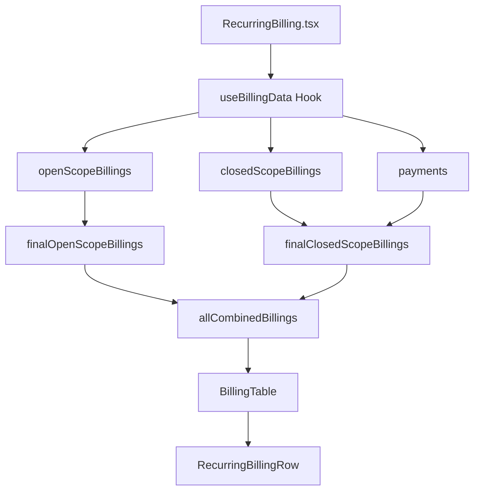
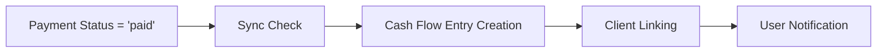

# 💰 Billing System Workflow Documentation

## 📋 Table of Contents
1. [System Overview](#system-overview)
2. [Two-Scope Architecture](#two-scope-architecture)
3. [Data Flow](#data-flow)
4. [Component Breakdown](#component-breakdown)
5. [Search & Filtering](#search--filtering)
6. [Payment Sync Workflow](#payment-sync-workflow)
7. [Status Management](#status-management)
8. [Troubleshooting](#troubleshooting)

## 🎯 System Overview

The FlowCode Financial billing system is designed around a **two-scope architecture** that handles different types of billing scenarios:

- **Open Scope (Escopo Aberto)**: Recurring billing for ongoing services
- **Closed Scope (Escopo Fechado)**: Fixed payments with defined installments

Both scopes are unified in the **"Todos"** tab, providing a comprehensive view of all financial obligations.

## 🏗️ Two-Scope Architecture

### Open Scope (Recurring Billing)


**Characteristics:**
- Ongoing services with regular billing cycles
- Configurable billing frequency (monthly, quarterly, etc.)
- Automatic payment generation
- Status: Active/Inactive (grouped view)

**Data Source:**
- Primary table: `recurring_billing`
- Related: Generated payments in `payments` table

### Closed Scope (Fixed Payments)


**Characteristics:**
- Fixed-amount payments with defined installments
- One-time or multi-installment projects
- Direct payment status tracking
- Status: Detailed payment statuses (Pendente, Pago, Atrasado, etc.)

**Data Source:**
- Primary table: `payments`
- Filtered by clients without active recurring billing

## 🔄 Data Flow

### Component Data Flow


### Data Transformation Pipeline

#### 1. **Raw Data Fetching**
```typescript
// useBillingData hook fetches:
const { 
  billings,        // recurring_billing table
  payments,        // payments table
  clients,         // clients table
  templates        // email_templates table
} = useBillingData();
```

#### 2. **Open Scope Processing**
```typescript
// Group recurring billings by client
const openScopeBillings = useMemo(() => {
  return billings?.filter(billing => billing.status !== 'cancelled')
    .map(billing => ({
      ...billing,
      // Calculate installment info
      // Determine general status
      // Add related payments
    }));
}, [billings]);
```

#### 3. **Closed Scope Processing**
```typescript
// Group payments by client (excluding those with active recurring billing)
const closedScopeBillings = useMemo(() => {
  const activeRecurringClients = new Set(/* active clients */);
  
  return payments
    .filter(payment => !activeRecurringClients.has(payment.client_id))
    .reduce((groups, payment) => {
      // Group by client_id
      // Calculate totals
      // Determine status
    }, {});
}, [payments, billings]);
```

#### 4. **Expansion Logic**
```typescript
// When expanded, show individual payments
const finalClosedScopeBillings = useMemo(() => {
  if (!expandCharges) {
    return closedScopeBillings; // Grouped view
  }
  
  // Expanded view: individual payments with formatted dates
  return allPayments.map(payment => ({
    ...payment,
    due_day: format(parseISO(payment.due_date + 'T00:00:00'), 'dd/MM/yyyy'),
    individual_payment: payment // Mark for modal handling
  }));
}, [closedScopeBillings, expandCharges, payments]);
```

## 🧩 Component Breakdown

### Core Components Hierarchy

```
RecurringBilling.tsx                    ← Main container
├── BillingTable.tsx                   ← Table wrapper
│   └── RecurringBillingRow.tsx        ← Individual row logic
├── PaymentDetailsDialog.tsx           ← Individual payment modal
└── PaymentDetailsDialog.tsx (recurring) ← Grouped billing modal
```

### Component Responsibilities

#### 1. **RecurringBilling.tsx**
- **Primary Role**: Data orchestration and tab management
- **Key Features**:
  - Three-tab interface (Todos, Escopo Aberto, Escopo Fechado)
  - Independent search states for each tab
  - Expand/collapse toggle for each scope
  - Status filtering with detailed options

```typescript
// Key state management
const [activeTab, setActiveTab] = useState("all");
const [allSearch, setAllSearch] = useState("");           // Todos tab
const [billingSearch, setBillingSearch] = useState("");   // Escopo Aberto
const [paymentSearch, setPaymentSearch] = useState("");   // Escopo Fechado

const [expandChargesAll, setExpandChargesAll] = useState(true);    // Todos
const [expandChargesOpen, setExpandChargesOpen] = useState(true);  // Escopo Aberto  
const [expandCharges, setExpandCharges] = useState(true);          // Escopo Fechado
```

#### 2. **BillingTable.tsx**
- **Primary Role**: Table rendering and action handling
- **Key Features**:
  - Modal state management
  - Duplicate functionality
  - Action delegation to rows

```typescript
const handleOpenDetails = (billing: RecurringBilling) => {
  if (billing.individual_payment) {
    // Individual payment modal
    setSelectedPayment(billing.individual_payment);
    setShowIndividualPaymentDetails(true);
  } else {
    // Grouped billing modal
    setSelectedBilling(billing);
    setShowPaymentDetails(true);
  }
};
```

#### 3. **RecurringBillingRow.tsx**
- **Primary Role**: Row-level rendering and status logic
- **Key Features**:
  - Dynamic status calculation
  - Context-aware actions
  - Date formatting

```typescript
// Status logic based on billing type
if (isExpandedPayment) {
  // Show real payment status: Pendente, Pago, Atrasado, etc.
  const realStatus = billing.individual_payment?.status || billing.status;
  statusInfo = RecurringBillingRowStatus[realStatus];
} else {
  // Show grouped status: Ativo/Inativo
  statusInfo = billing.status === 'cancelled' 
    ? { label: "Inativo", color: "bg-gray-500" }
    : { label: "Ativo", color: "bg-green-500" };
}
```

## 🔍 Search & Filtering

### Independent Search States

Each tab maintains its own search state to prevent interference:

```typescript
// Todos tab search
const filteredAllCombinedBillings = useMemo(() => {
  return allCombinedBillings.filter(billing => {
    const search = allSearch.toLowerCase(); // ← Todos-specific search
    // Apply search logic
  });
}, [allCombinedBillings, allSearch]);

// Escopo Aberto search  
const filteredBillings = useMemo(() => {
  return openScopeBillings.filter(billing => {
    const search = billingSearch.toLowerCase(); // ← Escopo Aberto search
    // Apply search logic
  });
}, [openScopeBillings, billingSearch]);
```

### Search Input Handling

```typescript
// Dynamic input handling based on active tab
<Input 
  placeholder="Buscar por cliente ou descrição..." 
  value={activeTab === "recurring" ? billingSearch : 
         (activeTab === "all" ? allSearch : paymentSearch)} 
  onChange={e => {
    if (activeTab === "recurring") {
      setBillingSearch(e.target.value);
    } else if (activeTab === "all") {
      setAllSearch(e.target.value);
    } else {
      setPaymentSearch(e.target.value);
    }
  }} 
/>
```

## 💳 Payment Sync Workflow

### Automatic Cash Flow Synchronization

When a payment is marked as "paid", it automatically syncs to the cash flow system:



#### Implementation Details

```typescript
// PaymentDetailsDialog.tsx - handleSave function
if (status === 'paid' && payment.status !== 'paid') {
  const syncResult = await syncPaymentToCashFlow(
    payment.id,
    payment.status,
    status,
    {
      description,
      amount: parseFloat(amount),
      payment_date: payOnDelivery ? null : (paymentDate || null),
      client_id: payment.client_id  // ← Critical: Client relationship
    }
  );
}
```

#### Sync Service Logic

```typescript
// paymentCashFlowSync.ts
export const syncPaymentToCashFlow = async (
  paymentId: string,
  oldStatus: string,
  newStatus: string,
  paymentData: PaymentSyncData
): Promise<SyncPaymentResult> => {
  
  // 1. Validation: Only sync newly paid payments
  if (newStatus !== 'paid' || oldStatus === 'paid') {
    return { success: true, message: 'No sync needed' };
  }
  
  // 2. Check for existing cash flow entry
  const existingEntry = await checkExistingCashFlow(paymentId);
  if (existingEntry) {
    return { success: true, message: 'Already synced' };
  }
  
  // 3. Create cash flow entry with client relationship
  await supabase.from('cash_flow').insert({
    type: 'income',
    description: paymentData.description,
    amount: paymentData.amount,
    date: paymentData.payment_date,
    category: 'payment',
    payment_id: paymentId,
    client_id: paymentData.client_id, // ← Maintains relationship
    status: 'pending'
  });
};
```

## 📊 Status Management

### Status Types by Scope

#### Open Scope (Grouped View)
- **Ativo**: Has active recurring billing
- **Inativo**: All billing cancelled

#### Closed Scope (Individual View)  
- **Pendente**: Payment due but not paid
- **Pago**: Payment completed
- **Atrasado**: Payment overdue
- **Cancelado**: Payment cancelled
- **Faturado**: Invoice generated
- **Aguardando NF**: Awaiting invoice
- **Parcialmente Pago**: Partial payment received

#### Todos Tab (Mixed View)
- Shows appropriate status based on expansion state
- Individual payments: Detailed statuses
- Grouped billings: Ativo/Inativo

### Status Color Mapping

```typescript
export const RecurringBillingRowStatus = {
  pending: { label: "Pendente", color: "bg-yellow-500" },
  paid: { label: "Pago", color: "bg-green-500" },
  overdue: { label: "Atrasado", color: "bg-red-500" },
  cancelled: { label: "Cancelado", color: "bg-gray-500" },
  partially_paid: { label: "Parcialmente Pago", color: "bg-blue-500" },
  billed: { label: "Faturado", color: "bg-purple-500" },
  awaiting_invoice: { label: "Aguardando NF", color: "bg-orange-500" },
};
```

## 🐛 Troubleshooting

### Common Issues & Solutions

#### 1. **"Payments disappear after marking as paid"**

**Root Cause**: Status filters may hide paid payments

**Solution Check**:
```typescript
// Verify filter includes 'paid' status
const paymentStatusDetailFilter = ["pending", "overdue", "paid"]; 
```

#### 2. **"Search doesn't work in Todos tab"**

**Root Cause**: Using wrong search state or data source

**Solution Check**:
```typescript
// Ensure using allSearch for Todos tab
const search = allSearch.toLowerCase(); // ← Correct for Todos
// not: paymentSearch.toLowerCase(); ← Wrong for Todos
```

#### 3. **"Dates show as 'Dia XX' instead of full date"**

**Root Cause**: Using raw data instead of processed data

**Solution Check**:
```typescript
// Ensure using final processed data sources
const openScopeSource = expandChargesAll ? finalOpenScopeBillings : openScopeBillings;
const closedScopeSource = expandChargesAll ? finalClosedScopeBillings : closedScopeBillings;
```

#### 4. **"Status doesn't show correctly"**

**Root Cause**: Incorrect billing type detection

**Solution Check**:
```typescript
// Verify billing type detection
const isVirtualBilling = Boolean(billing.related_payments);
const isExpandedPayment = Boolean(billing.individual_payment);
```

### Debug Workflow

1. **Check Data Sources**: Verify correct data is being used for each tab
2. **Verify Search State**: Ensure the right search variable is active
3. **Check Expansion State**: Confirm expand/collapse affects the right data
4. **Validate Status Logic**: Review billing type detection in RecurringBillingRow
5. **Test Sync Flow**: Verify payment-to-cashflow sync includes client_id

This comprehensive workflow documentation provides the foundation for understanding and maintaining the FlowCode Financial billing system.